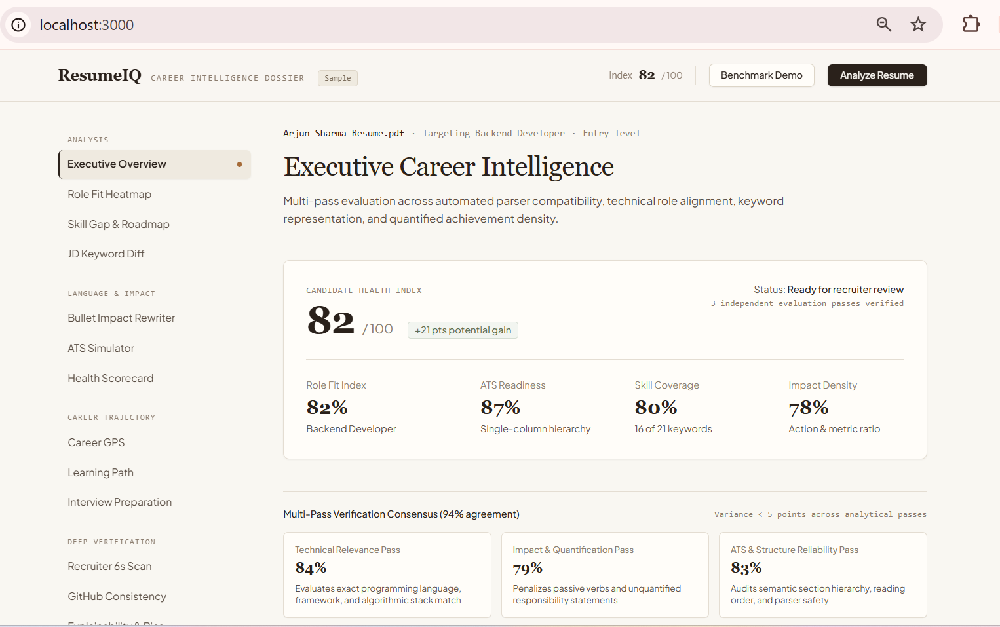
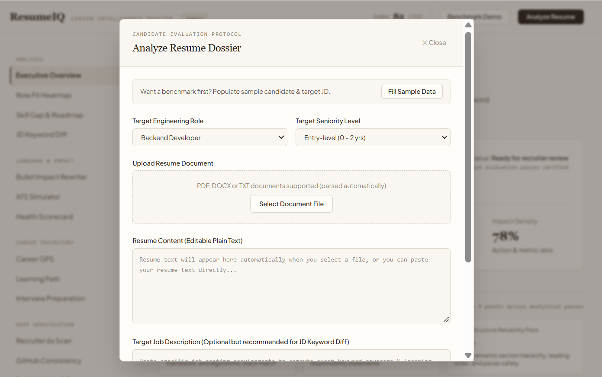
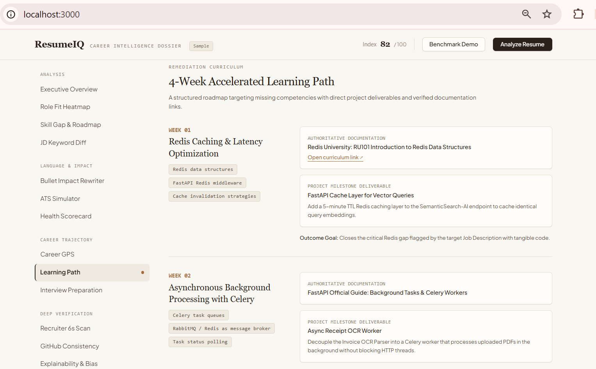
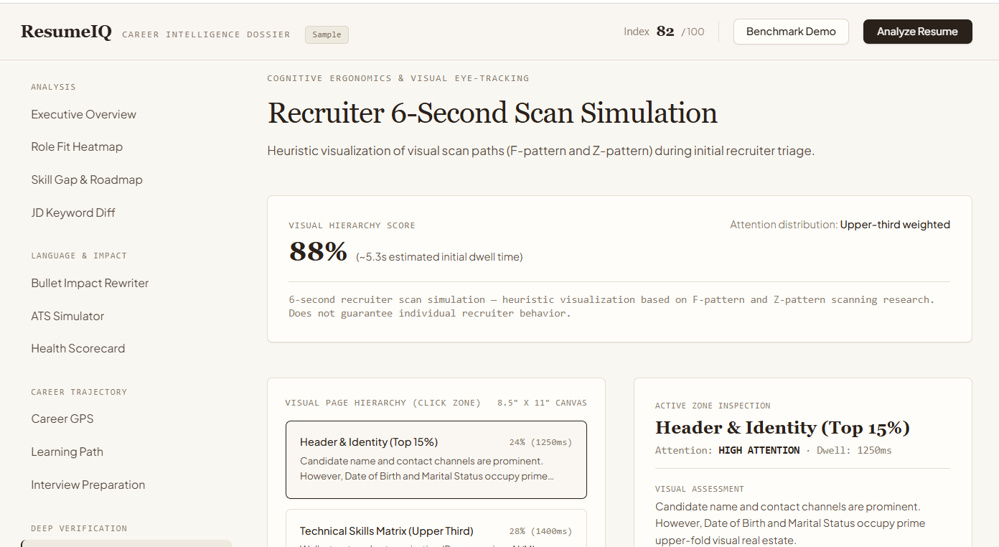

# ResumeIQ — Career Intelligence Platform

A state-of-the-art AI-powered career intelligence and resume analysis platform with multi-role fit radar, ATS simulation, bullet impact rewriter, recruiter attention modeling, and career trajectory navigation.

---

## 💻 Running in VS Code

Depending on whether you wish to run the **Full-Stack Web App (React + Vite + Express)** or the **Python Streamlit Application (app.py)**, follow the instructions below:

### Option 1: Full-Stack Web App (Recommended)
This runs the complete modern web application with high-fidelity quiet luxury aesthetic, live document upload, interactive tabs, and PDF export:

```bash
# 1. Install dependencies
npm install

# 2. Start the dev server
npm run dev
```
Open [http://localhost:3000](http://localhost:3000) in your browser.

---

### Option 2: Python Streamlit Application
If you prefer running the Python Streamlit version:

```bash
# 1. Install Python dependencies
pip install -r requirements.txt

# 2. Launch the Streamlit application
streamlit run app.py
```
Open [http://localhost:8501](http://localhost:8501) in your browser.

---

## 🌟 Included Capabilities & Workspaces

1. **Executive Overview**: High-level health score (0-100), key metrics, and strengths/remediation breakdown.
2. **Multi-Role Fit Radar**: Evaluates fit across 5+ distinct roles (Backend, AI/ML, Data Analyst, Cloud/DevOps, Full Stack).
3. **Skill Gap → 4-Week Learning Roadmap**: Weekly actionable milestones with project deliverables.
4. **Action Verb + Metric + Result Bullet Rewriter**: Scores statements and suggests quantified, action-oriented rewrites.
5. **ATS Parsing Engine & Simulation**: Side-by-side comparison of original text buffer vs. ATS extracted fields.
6. **Job Description Keyword Diff**: Full presence/missing comparison without keyword-stuffing.
7. **Career GPS Trajectory Predictor**: Multi-stage progression path from current baseline to senior engineering.
8. **Recruiter 6-Second Scan Heuristic**: Heuristic visual scan path across quadrants with dwell-time diagnostics.
9. **GitHub & Public Artifact Consistency**: Cross-references public repositories and languages against claims.
10. **Explainable AI Attribution & Bias Audit**: SHAP-style positive/negative score factor contributions and demographic neutrality checks.
11. **Resume Health Scorecard**: Interactive checklist simulating point gains as fixes are applied.
12. **Technical Interview Preparation**: Tailored technical, project, and behavioral questions with sample responses.
13. **Archival Export**: Instant PDF, JSON, and Markdown downloads.

## 📸 Project Screenshots

### Executive Overview



### Resume Analyzer



### Resume Analysis Dashboard



### 6S Scan


